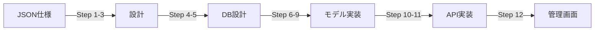

# Backend Development Tools

Ruby on Rails/PostgreSQL バックエンド開発向けの包括的なツール群です。JSON仕様からAPI・管理画面の実装までをサポートします。

## 含まれるスキル

### 1. orchestrating-api-implementation

JSONで定義されたAPI仕様を元にRuby on RailsでAPIと管理画面を実装するスキルです。

**主な機能:**
- JSON仕様ファイルの解析とモデル構造の把握
- 技術スタック（管理画面方式）の選定
- ユースケースの洗い出し
- DBスキーマ設計とマイグレーション生成
- インデックス設計（通常/GINインデックス）
- Active Recordモデルの実装（リレーション・スコープ・バリデーション）
- RESTful APIエンドポイントの実装
- 管理画面の実装（ActiveAdmin / Administrate / Hotwire）
- APIテスト（RSpec）

**詳細:** [skills/orchestrating-api-implementation/SKILL.md](./skills/orchestrating-api-implementation/SKILL.md)

## 技術スタック

生成されるコードは、以下の技術スタックを前提としています：

| 項目 | 技術 |
|------|------|
| 言語 | Ruby 3.4 |
| フレームワーク | Ruby on Rails 8.1 |
| データベース | PostgreSQL 18 |
| ORM | Active Record |
| テスト | RSpec |
| 管理画面 | ActiveAdmin / Administrate / Hotwire（選択可能） |

## 使い方

### 基本的なワークフロー

JSON仕様からAPI・管理画面の実装までを12ステップで進めます：



### 使用例

```bash
# Claude Codeで以下を実行
/skill orchestrating-api-implementation

# JSON仕様ファイルを指定
"spec.jsonの仕様に基づいてAPIと管理画面を実装してください"
```

## ディレクトリ構造

```
backend_development/
├── .claude-plugin/
│   └── marketplace.json          # スキル登録情報
├── skills/                       # スキル
│   └── orchestrating-api-implementation/
│       ├── SKILL.md              # スキル概要
│       ├── references/           # 参照ドキュメント
│       │   └── 01_json_specification.md
│       └── steps/                # 各ステップの詳細ガイド
│           ├── 01_check_specification.md
│           ├── 02_select_tech_stack.md
│           ├── 03_define_usecases.md
│           ├── 04_design_db_schema.md
│           ├── 05_define_sql_and_indexes.md
│           ├── 06_initialize_project.md
│           ├── 07_implement_migration.md
│           ├── 08_implement_orm.md
│           ├── 09_implement_validation.md
│           ├── 10_implement_api_endpoints.md
│           ├── 11_verify_api.md
│           └── 12_implement_admin_ui.md
└── README.md                     # このファイル
```

## インストール方法

### Claude Code Marketplaceから（推奨）

1. マーケットプレイスにこのリポジトリを追加:
```
/plugin marketplace add xtone/ai_development_tools
```

2. プラグインをインストール:
```
/plugin install backend-development@xtone-ai-development-tools
```

### 手動インストール

1. このリポジトリをクローン:
```bash
git clone https://github.com/xtone/ai_development_tools.git
```

2. プラグインディレクトリをClaude Codeの設定ディレクトリにコピー:
```bash
cp -r ai_development_tools/backend_development ~/.claude/plugins/
```

## 必要な環境

- Claude Code 0.1.0 以上
- Ruby 3.4 以上
- Ruby on Rails 8.1 以上
- PostgreSQL 18 以上

## 作成者

**TOYOTA, Yoichi**
- Email: y.toyota@xtone.co.jp
- Organization: XTONE

## バージョン履歴

### v0.1.0
- 初期リリース
- orchestrating-api-implementation スキルを追加

## ライセンス

MIT License

## 参考リンク

- [Claude Code公式ドキュメント](https://docs.claude.com/ja/docs/claude-code)
- [Claude Code Plugins](https://docs.claude.com/ja/docs/claude-code/plugins)
- [Claude Code Skills](https://docs.claude.com/ja/docs/claude-code/skills)
