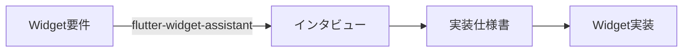

# Flutter Development Tools

Flutter開発向けの包括的なツール群です。Widget実装の設計判断からコード生成まで、Flutter開発をサポートします。

## 📦 含まれるスキル

### 1. flutter-widget-assistant

Flutter Widget実装のためのインタラクティブなアシスタントです。構造化された質問を通じて、最適なWidgetアーキテクチャを決定します。

**主な機能:**
- 状態管理の必要性を判断（StatefulWidget vs StatelessWidget）
- Widget種別の決定（Screen vs Component）
- 状態共有の判断（Riverpod使用 vs 不使用）
- 構造化された実装仕様書の生成
- Flutter/AutoRoute/Riverpod のベストプラクティスに基づいた設計支援

**詳細:** [skills/flutter-widget-assistant/SKILL.md](./skills/flutter-widget-assistant/SKILL.md)

## 🚀 使い方

### 基本的なワークフロー



### ステップ1: Widget設計アシスタントの起動

```bash
# Claude Codeで以下を実行
/skill flutter-widget-assistant

# または直接説明と共に
"ログイン画面を実装したいです。設計を手伝ってください。"
```

### ステップ2: インタビューに回答

アシスタントが3つの重要な質問を順番に行います：

1. **状態管理の必要性** → StatefulWidget / StatelessWidget
2. **Widget種別** → 画面/ページ / コンポーネント/部品
3. **画面間の状態共有** → Riverpod使用 / 不使用

### ステップ3: 実装仕様書の取得

アシスタントが構造化された仕様書を生成します。仕様書には以下が含まれます：

- Widget情報（名前、説明）
- アーキテクチャの決定事項
- 実装チェックリスト
- コード構造テンプレート

### ステップ4: 実装の実行

```bash
"この仕様書に基づいてLoginScreenを実装してください"
```

## 💡 使用例

### 例1: シンプルなボタンコンポーネント

```
User: "カスタムボタンコンポーネントを作りたいです"
Assistant: "了解しました。いくつか質問させてください。"

Q1: 状態管理 → "いいえ（クリック時のコールバックのみ）"
Q2: Widget種別 → "コンポーネント"
Q3: 状態共有 → "いいえ"

結果: StatelessWidget（props駆動のシンプルなコンポーネント）
```

### 例2: ログイン画面

```
User: "ログイン画面を実装したいです"
Assistant: "了解しました。いくつか質問させてください。"

Q1: 状態管理 → "はい（フォーム入力、バリデーション）"
Q2: Widget種別 → "画面"
Q3: 状態共有 → "はい（認証状態を他の画面でも使用）"

結果: HooksConsumerWidget + AutoRoute + ViewModel + UIState + Riverpod
```

### 例3: カウンターウィジェット

```
User: "カウンターウィジェットを作りたいです"
Assistant: "了解しました。いくつか質問させてください。"

Q1: 状態管理 → "はい（カウンター値）"
Q2: Widget種別 → "コンポーネント"
Q3: 状態共有 → "いいえ（ローカル状態のみ）"

結果: StatefulWidget（ローカル状態管理のシンプルなコンポーネント）
```

## 🛠️ 技術スタック

生成される実装は、以下の技術スタックを前提としています：

- **フレームワーク:** Flutter
- **ナビゲーション:** AutoRoute
- **状態管理:** Riverpod（オプション）
- **フック:** flutter_hooks（オプション）
- **アーキテクチャ:** MVVM（画面レベル）

## インストール方法

### Claude Code Marketplaceから（推奨）

1. マーケットプレイスにこのリポジトリを追加:
```
/plugin marketplace add xtone/ai_development_tools
```

2. プラグインをインストール:
```
/plugin install flutter-development@xtone-ai-development-tools
```

### 手動インストール

1. このリポジトリをクローン:
```bash
git clone https://github.com/xtone/ai_development_tools.git
```

2. プラグインディレクトリをClaude Codeの設定ディレクトリにコピー:
```bash
cp -r ai_development_tools/flutter_development ~/.claude/plugins/
```

## 必要な環境

- Claude Code 0.1.0 以上
- Flutter SDK 3.0.0 以上（プロジェクトで使用する場合）

## トラブルシューティング

### Skillが認識されない

プラグインが正しくインストールされているか確認してください:
```
/plugin list
```

## 🤝 貢献

このツール群の改善提案やバグ報告は、以下の方法で行ってください：

1. 新しいガイドやテンプレートの追加
2. 既存ガイドの改善
3. バグ修正
4. ドキュメントの改善

Issue報告やPull Requestを歓迎します。

## 📝 ライセンス

MIT License

## 👤 作成者

**HINO, Yusaku**
- Email: y.hino@xtone.co.jp
- Organization: XTONE

## 🔄 バージョン履歴

### v0.1.0 (2025-11-11)
- 初期リリース
- `flutter-widget-assistant` スキルの実装
- インタラクティブなインタビュー形式での設計支援

## 参考リンク

- [Claude Code公式ドキュメント](https://docs.claude.com/ja/docs/claude-code)
- [Claude Code Plugins](https://docs.claude.com/ja/docs/claude-code/plugins)
- [Claude Code Skills](https://docs.claude.com/ja/docs/claude-code/skills)
- [Flutter公式ドキュメント](https://flutter.dev/)
- [AutoRoute](https://pub.dev/packages/auto_route)
- [Riverpod](https://riverpod.dev/)
