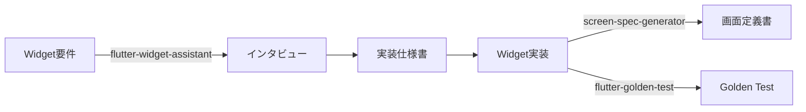

# Flutter Development Tools

Flutter開発向けの包括的なツール群です。Widget実装の設計判断から画面定義書の作成、Golden Testまで、Flutter開発をサポートします。

## 含まれるスキル

### 1. flutter-widget-assistant

Flutter Widget実装のためのインタラクティブなアシスタントです。構造化された質問を通じて、最適なWidgetアーキテクチャを決定します。

**主な機能:**
- 状態管理の必要性を判断（StatefulWidget vs StatelessWidget）
- Widget種別の決定（Screen vs Component）
- 状態共有の判断（Riverpod使用 vs 不使用）
- 構造化された実装仕様書の生成
- Flutter/AutoRoute/Riverpod のベストプラクティスに基づいた設計支援

**詳細:** [skills/flutter-widget-assistant/README.md](./skills/flutter-widget-assistant/README.md)

### 2. screen-spec-generator

Flutterプロジェクトの画面定義書を作成・管理するスキルです。プロジェクト構造を自動解析し、会話形式でテンプレートをカスタマイズします。

**主な機能:**
- プロジェクト構造の自動解析（CLAUDE.md対応）
- セクション選択による柔軟なテンプレート作成
- カスタムコマンド（/screen-spec）の自動生成
- 個別画面の定義書自動生成
- 既存定義書の差分検出と更新

**詳細:** [skills/screen-spec-generator/README.md](./skills/screen-spec-generator/README.md)

### 3. flutter-golden-test

Golden Test（Visual Regression Test）環境のセットアップとテスト生成を対話形式で行うスキルです。Flutter初心者でもGolden Test環境を構築できます。

**主な機能:**
- Golden Test環境の初期セットアップ（flutter_test_config.dart、ヘルパー生成）
- コンポーネント/画面のGolden Testコード生成
- 日本語フォント対応
- Riverpod対応（ProviderScopeラップ）
- レスポンシブテスト（複数画面サイズ）
- トラブルシューティング支援

**詳細:** [skills/flutter-golden-test/README.md](./skills/flutter-golden-test/README.md)

## 技術スタック

生成される実装は、以下の技術スタックを前提としています：

| 項目 | 技術 |
|------|------|
| フレームワーク | Flutter |
| ナビゲーション | AutoRoute |
| 状態管理 | Riverpod（オプション） |
| フック | flutter_hooks（オプション） |
| アーキテクチャ | MVVM（画面レベル） |

## 使い方

### 基本的なワークフロー



### 使用例

#### flutter-widget-assistant

```bash
# Claude Codeで以下を実行
/skill flutter-widget-assistant

# または直接説明と共に
"ログイン画面を実装したいです。設計を手伝ってください。"
```

#### screen-spec-generator

```bash
# 初期セットアップ
"画面定義書を作成したい"

# 画面定義書の生成（セットアップ後）
/screen-spec lib/ui/mypage/widgets/mypage_page.dart
```

#### flutter-golden-test

```bash
# 初期セットアップ
"Golden Testを導入したい"

# テスト生成
"PrimaryButtonのGolden Testを書いて"

# テスト実行
flutter test --update-goldens test/ui/components/primary_button_golden_test.dart
```

## ディレクトリ構造

```
flutter_development/
├── .claude-plugin/
│   ├── marketplace.json          # スキル登録情報
│   └── plugin.json
├── skills/
│   ├── flutter-widget-assistant/ # Widget設計支援スキル
│   │   ├── SKILL.md
│   │   └── README.md
│   ├── screen-spec-generator/    # 画面定義書生成スキル
│   │   ├── SKILL.md
│   │   ├── README.md
│   │   └── templates/
│   └── flutter-golden-test/      # Golden Testスキル
│       ├── SKILL.md
│       ├── README.md
│       ├── knowledge/            # 基礎知識・トラブルシューティング
│       └── templates/            # テストテンプレート
└── README.md                     # このファイル
```

## インストール方法

### Claude Code Marketplaceから（推奨）

1. マーケットプレイスにこのリポジトリを追加:
```
/plugin marketplace add xtone/ai_development_tools
```

2. プラグインをインストール:
```
/plugin install flutter-development@xtone-ai-development-tools
```

### 手動インストール

1. このリポジトリをクローン:
```bash
git clone https://github.com/xtone/ai_development_tools.git
```

2. プラグインディレクトリをClaude Codeの設定ディレクトリにコピー:
```bash
cp -r ai_development_tools/flutter_development ~/.claude/plugins/
```

## 必要な環境

- Claude Code 0.1.0 以上
- Flutter SDK 3.0.0 以上（プロジェクトで使用する場合）

## トラブルシューティング

### Skillが認識されない

プラグインが正しくインストールされているか確認してください:
```
/plugin list
```

## 作成者

**HINO, Yasushi**
- Email: y.hino@xtone.co.jp
- Organization: XTONE

## バージョン履歴

### v0.3.0 (2026-02-06)
- `flutter-golden-test` スキルを追加
- Golden Test環境のセットアップとテスト生成機能を追加

### v0.2.0 (2026-02-06)
- `screen-spec-generator` スキルを統合
- 画面定義書の作成・管理機能を追加

### v0.1.0 (2025-11-11)
- 初期リリース
- `flutter-widget-assistant` スキルの実装

## ライセンス

MIT License

## 参考リンク

- [Claude Code公式ドキュメント](https://docs.claude.com/ja/docs/claude-code)
- [Claude Code Plugins](https://docs.claude.com/ja/docs/claude-code/plugins)
- [Claude Code Skills](https://docs.claude.com/ja/docs/claude-code/skills)
- [Flutter公式ドキュメント](https://flutter.dev/)
- [AutoRoute](https://pub.dev/packages/auto_route)
- [Riverpod](https://riverpod.dev/)
