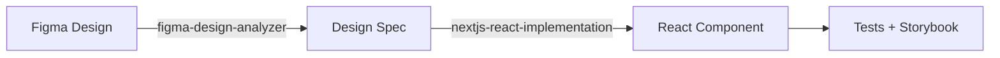

# Frontend Next.js Development Tools

Next.js/React開発向けの包括的なツール群です。Figmaデザインの分析から本番環境向けコンポーネントの実装まで、デザインシステムの構築をエンドツーエンドでサポートします。

## 📦 含まれるスキル

### 1. figma-design-analyzer

Figmaデザインを体系的に分析し、構造化された設計仕様書を生成します。

**主な機能:**
- Figma MCP toolsを使った設計情報の抽出
- レイアウト分析（Flexbox/Grid/Positioning判定）
- スペーシング抽出（padding/gap/margin）
- タイポグラフィ抽出（font/size/weight/color等）
- Atomic Design分類（Atom/Molecule/Organism判定）
- セマンティックHTML要素選択
- 設計仕様の構造化（Markdown形式で出力）

**詳細:** [skills/figma-design-analyzer/SKILL.md](./skills/figma-design-analyzer/SKILL.md)

### 2. nextjs-react-implementation

設計仕様書から本番環境向けのNext.js/Reactコンポーネントを生成します。

**主な機能:**
- React/TypeScriptコンポーネント生成
- Tailwind CSSスタイリング
- TypeScript型定義
- Vitest browser modeテスト生成
- Storybookストーリー生成
- レスポンシブ対応の実装

**詳細:** [skills/nextjs-react-implementation/SKILL.md](./skills/nextjs-react-implementation/SKILL.md)

## 🚀 使い方

### 基本的なワークフロー

2つのスキルを組み合わせて、Figmaデザインから実装までをカバーします：



### ステップ1: デザイン分析

Figmaデザインを分析し、設計仕様書を生成します：

```bash
# Claude Codeで以下を実行
/skill figma-design-analyzer

# Figma URLを指定
"このFigmaボタンコンポーネントを分析してください: https://figma.com/design/abc123?node-id=123-456"
```

**出力例:** `Button.design.md` - 構造化された設計仕様書

### ステップ2: コンポーネント実装

設計仕様書から実装を生成します：

```bash
# Claude Codeで以下を実行
/skill nextjs-react-implementation

# 設計仕様書を指定
"Button.design.mdから実装を生成してください"
```

**出力例:**
```
components/atoms/Button/
├── index.ts
├── Button.tsx
├── Button.test.tsx
└── Button.stories.tsx
```

### 連続実行

両方のスキルを連続して実行することも可能です：

```bash
# 1回のリクエストで分析→実装
"このFigmaボタンを分析して実装まで行ってください: https://figma.com/design/abc123?node-id=123-456"
```

Claude Codeが自動的に：
1. `figma-design-analyzer`スキルでデザインを分析
2. 設計仕様書を生成
3. `nextjs-react-implementation`スキルで実装を生成

## 📁 ディレクトリ構造

```
frontend_nextjs_development/
├── .claude-plugin/
│   └── marketplace.json          # スキル登録情報
├── agents/                       # エージェント（将来用）
├── commands/                     # コマンド（将来用）
├── hooks/                        # フック（将来用）
├── skills/                       # スキル
│   ├── figma-design-analyzer/   # デザイン分析スキル
│   │   ├── SKILL.md
│   │   └── references/          # 分析ガイド
│   │       ├── layout-analysis-guide.md
│   │       ├── spacing-extraction-guide.md
│   │       ├── typography-extraction-guide.md
│   │       ├── atomic-design-classification.md
│   │       └── semantic-html-guide.md
│   └── nextjs-react-implementation/  # 実装生成スキル
│       ├── SKILL.md
│       └── assets/
│           └── templates/       # 実装テンプレート
│               ├── component.tsx.template
│               ├── test.tsx.template
│               └── storybook.tsx.template
├── shared/                      # 共有リソース
│   ├── design-spec-format.md   # 仕様書フォーマット定義
│   └── Button.design.md.example # 仕様書サンプル
└── README.md                    # このファイル
```

## 🎯 設計仕様書フォーマット

2つのスキル間のデータ受け渡しには、構造化されたMarkdown形式の設計仕様書を使用します。

**フォーマット詳細:** [shared/design-spec-format.md](./shared/design-spec-format.md)

**サンプル:** [shared/Button.design.md.example](./shared/Button.design.md.example)

## 💡 使用例

### 例1: シンプルなボタンコンポーネント

```bash
"このFigmaのボタンを分析して実装してください: https://figma.com/..."
```

生成される成果物：
- `Button.design.md` - 設計仕様書
- `components/atoms/Button/` - 実装一式

### 例2: 複雑な検索バー（Molecule）

```bash
"このFigmaの検索バーを分析して実装してください: https://figma.com/..."
```

生成される成果物：
- `SearchBar.design.md` - 設計仕様書
- 必要に応じて子コンポーネントの仕様書（Input.design.md, Button.design.md等）
- `components/molecules/SearchBar/` - 実装一式

### 例3: フルページのレイアウト（Organism）

```bash
"このFigmaのヘッダーコンポーネントを分析して実装してください: https://figma.com/..."
```

生成される成果物：
- `Header.design.md` - 親コンポーネントの仕様書
- 子コンポーネントの仕様書（Logo.design.md, Navigation.design.md等）
- `components/organisms/Header/` - 実装一式

### 例4: 既存実装との比較

```bash
"このFigmaデザインと既存のButtonコンポーネントを比較してください: https://figma.com/..."
```

`figma-design-analyzer`スキルが：
1. Figmaデザインを分析
2. 既存実装を読み込み
3. 差分レポートを生成
4. 修正が必要な箇所を特定

## 🛠️ 技術スタック

生成されるコンポーネントは、以下の技術スタックを前提としています：

- **フレームワーク:** Next.js (App Router)
- **言語:** TypeScript
- **スタイリング:** Tailwind CSS
- **テスト:** Vitest (browser mode)
- **ドキュメント:** Storybook
- **デザイン原則:** Atomic Design

## インストール方法

### Claude Code Marketplaceから（推奨）

1. マーケットプレイスにこのリポジトリを追加:
```
/plugin marketplace add xtone/ai_development_tools
```

2. プラグインをインストール:
```
/plugin install frontend-nextjs-development@xtone-ai-development-tools
```

### 手動インストール

1. このリポジトリをクローン:
```bash
git clone https://github.com/xtone/ai_development_tools.git
```

2. プラグインディレクトリをClaude Codeの設定ディレクトリにコピー:
```bash
cp -r ai_development_tools/frontend_nextjs_development ~/.claude/plugins/
```

## 📚 リファレンス

### 分析ガイド（figma-design-analyzer）

- [Layout Analysis Guide](./skills/figma-design-analyzer/references/layout-analysis-guide.md) - レイアウト手法の判定基準
- [Spacing Extraction Guide](./skills/figma-design-analyzer/references/spacing-extraction-guide.md) - スペーシング値の抽出方法
- [Typography Extraction Guide](./skills/figma-design-analyzer/references/typography-extraction-guide.md) - タイポグラフィの抽出とマッピング
- [Atomic Design Classification](./skills/figma-design-analyzer/references/atomic-design-classification.md) - Atomic Design分類の基準
- [Semantic HTML Guide](./skills/figma-design-analyzer/references/semantic-html-guide.md) - セマンティックHTML要素の選択ガイド

### 実装テンプレート（nextjs-react-implementation）

- [Component Template](./skills/nextjs-react-implementation/assets/templates/component.tsx.template) - React/TypeScriptコンポーネントテンプレート
- [Test Template](./skills/nextjs-react-implementation/assets/templates/test.tsx.template) - Vitestテストテンプレート
- [Storybook Template](./skills/nextjs-react-implementation/assets/templates/storybook.tsx.template) - Storybookストーリーテンプレート

## 必要な環境

- Claude Code 0.1.0 以上
- Node.js 18.0.0 以上（プロジェクトで使用する場合）
- Figma Desktop App（figma-design-analyzerを使用する場合）

## トラブルシューティング

### Skillが認識されない

プラグインが正しくインストールされているか確認してください:
```
/plugin list
```

### Figma MCPツールが使えない

Figma Desktop Appがインストールされており、Claude CodeのMCP設定でFigmaサーバーが有効になっているか確認してください。

## 🤝 貢献

このツール群の改善提案やバグ報告は、以下の方法で行ってください：

1. 新しいガイドやテンプレートの追加
2. 既存ガイドの改善
3. バグ修正
4. ドキュメントの改善

Issue報告やPull Requestを歓迎します。詳細は [CONTRIBUTING.md](../CONTRIBUTING.md) を参照してください。

## 📝 ライセンス

MIT License

## 👤 作成者

**TOYOTA, Yoichi**
- Email: y.toyota@xtone.co.jp
- Organization: XTONE

## 🔄 バージョン履歴

### v0.2.0 (2025-10-21)
- figma-design-extractorスキルを2つのスキルに分離
  - `figma-design-analyzer`: デザイン分析
  - `nextjs-react-implementation`: コンポーネント実装
- 設計仕様書フォーマットの定義
- 包括的なドキュメント整備

### v0.1.0
- 初期リリース（figma-design-extractor統合スキル）

## 参考リンク

- [Claude Code公式ドキュメント](https://docs.claude.com/ja/docs/claude-code)
- [Claude Code Plugins](https://docs.claude.com/ja/docs/claude-code/plugins)
- [Claude Code Skills](https://docs.claude.com/ja/docs/claude-code/skills)
- [Figma MCP Server](https://github.com/anthropics/mcp-servers/tree/main/src/figma)
